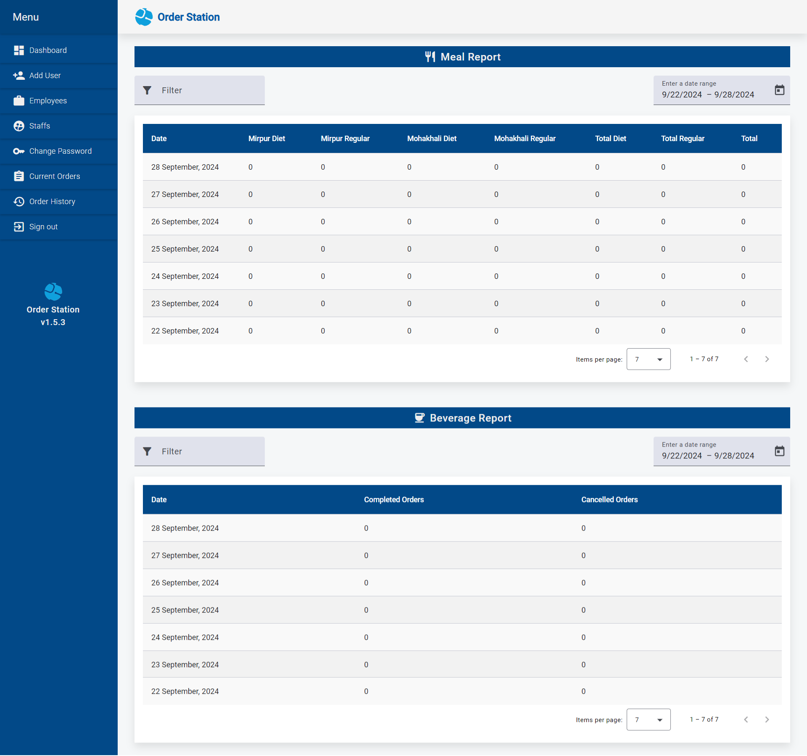
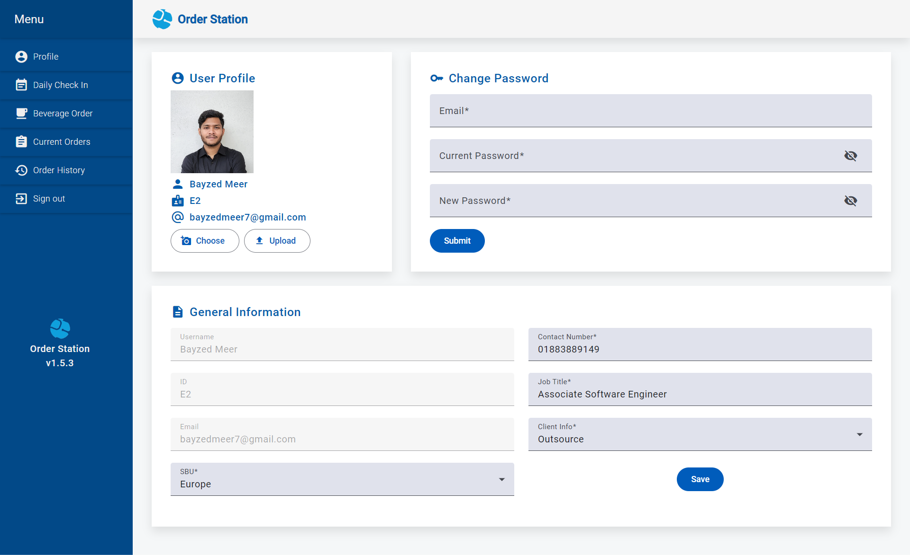
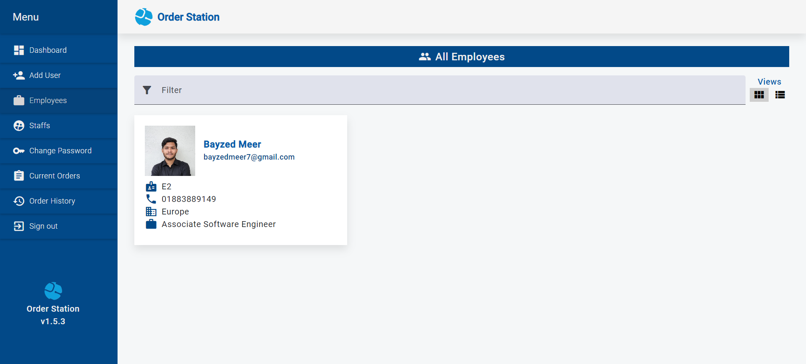
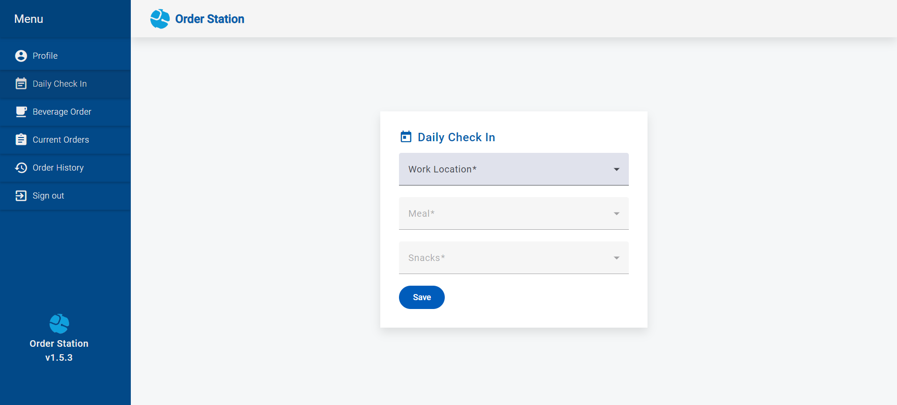
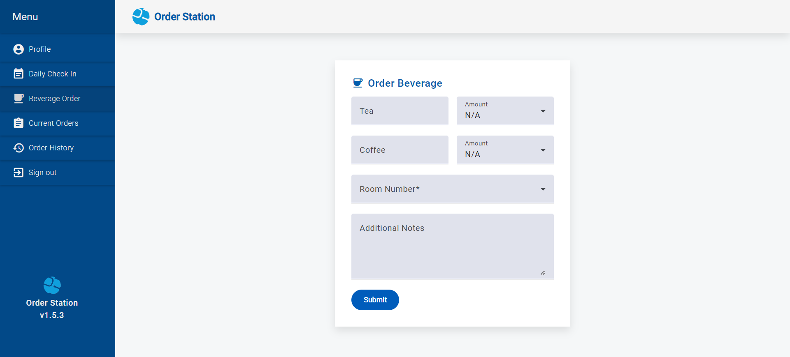
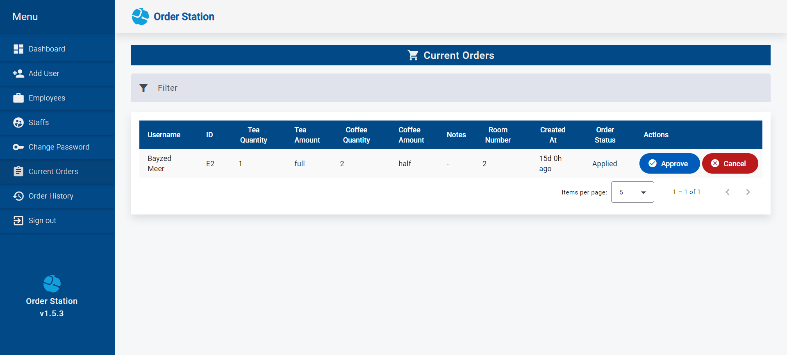
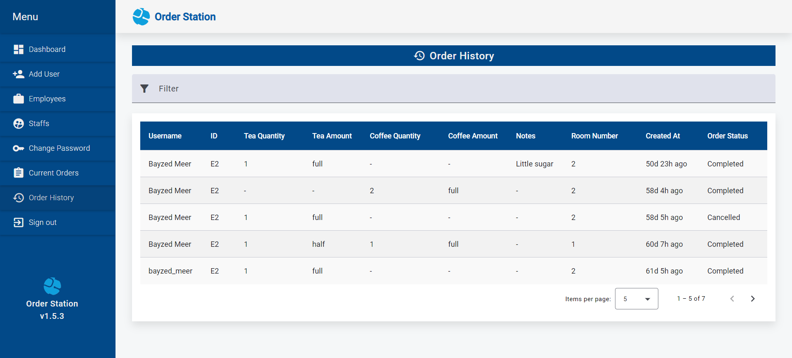

# Order Station

[Order Station](https://order-station.netlify.app/) is an office food and beverage management system designed to prevent food wastage by allowing employees to submit their daily preferences for lunch and evening snacks. The system also enables employees to order tea and coffee, with staff having the ability to approve orders and receive real-time updates. It provides reports on orders across company branches, helping streamline management. The admin panel allows for user management and viewing of order reports, while automated email reminders notify employees who miss their daily check-in.

## Features

-   **User Authentication & Authorization**: Secure login via email and JWT tokens.
-   **Employee & Staff Profiles**: Users can view and update their profiles. Can also reset passwords.
-   **Daily Check-In**: Employees can submit their lunch and beverage preferences.
-   **Real-Time Order Updates**: Staff and employees get instant order status updates.
-   **Current Orders & History**: Employees, staff, and admins can view current and past orders. Employees only see their own orders.
-   **Email Reminders**: Automated email notifications for users who forget to check in.
-   **Admin Panel**: Admins can manage users, view reports, and handle branches.
-   **Branch Management**: Admins can manage branches and assign staff to them.
-   **Reports**: Admins can generate reports on lunch and beverage orders.
-   **Filter Reports**: Admins can filter reports by date.
-   **Filter Search**: Admins can search for users by name, email, or role.
-   **Card View & List View**: Admins can switch between card and list views for users.
-   **WebSocket**: Enables real-time updates on order statuses.
-   **Nodemailer**: Sends emails for forgotten passwords and reminders.

## Tech Stack

-   **Frontend**: Angular, Angular Material
-   **Backend**: Node.js, Express.js
-   **Database**: MongoDB
-   **Other Tools**: WebSocket, Nodemailer

## Screenshots

### Admin Dashboard



### Employee & Staff Profiles



### User Management



### Daily Check-In



### Beverage Orders



### Current Orders



### Order History



## Installation

### Prerequisites

-   **Node.js**
-   **MongoDB**

### Steps to Set Up

1. Clone the frontend and backend repositories:

    ```bash
    git clone https://github.com/Bayzed-Meer/Order-Station-Frontend.git
    git clone https://github.com/Bayzed-Meer/Order-Station-Backend.git
    ```

2. Navigate to the frontend and backend directories and install the dependencies:

    ```bash
    cd Order-Station-Frontend
    npm install
    cd Order-Station-Backend
    npm install
    ```

3. In the backend project, create a `.env` file and configure the following environment variables:

    ```bash
    PORT=3000
    MONGODB_URI=your-mongodb-uri
    JWT_ACCESS_SECRET_KEY=your-access-token-secret-key
    JWT_REFRESH_SECRET_KEY=your-refresh-token-secret-key
    JWT_SECRET_KEY=your-secret-key
    EMAIL_USER=your-email-address
    EMAIL_PASS=your-password
    FRONTEND_URL=your-frontend-url
    ```

4. Start the backend server:

    ```bash
    npm start
    ```

5. Start the frontend server:

    ```bash
    npm start
    ```

6. Access the application at `http://localhost:4200`.

### Default User Credentials

-   **Admin**

    -   Email: `admin@gmail.com`
    -   Password: `Password123$`

-   **Staff**

    -   Email: `staff@gmail.com`
    -   Password: `Password123$`

-   **Employee**
    -   Email: `employee@gmail.com`
    -   Password: `Password123$`

## Usage

-   Employees can log in, place orders, and receive real-time updates.
-   Admins can log in to the admin panel, view reports, and manage users.
-   Staff can approve or reject orders and track them in real-time.

## Future Improvements

-   Add social media login (Google, Facebook, etc.).
-   Enhance the admin dashboard with graphs and better data visualization.

## Contributions

I welcome contributions! Please feel free to fork the project, submit pull requests, or create issues.

## Contact

For any issues or collaboration, feel free to reach out to me on [LinkedIn](https://www.linkedin.com/in/bayzed-meer/).
